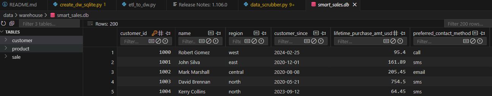
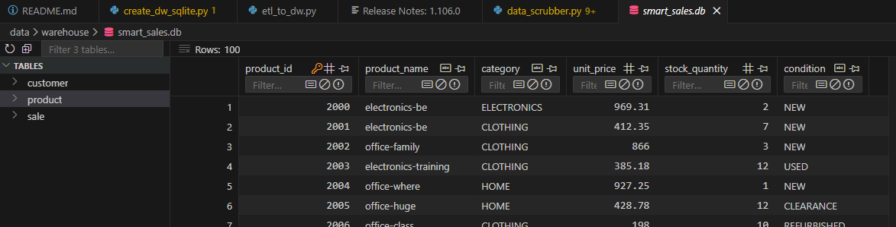
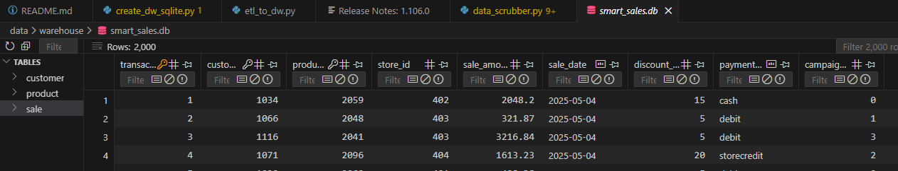
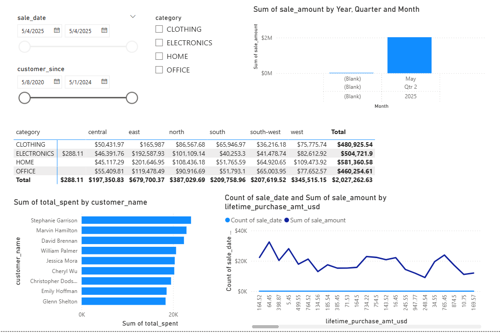

# Pro Analytics 02 Python Starter Repository

> This contains my start of a professional Python project.

- Additional information: <https://github.com/kaitlin-hodges/smart-store-kaitlinhodges>
- Project organization: [STRUCTURE](./STRUCTURE.md)
- Build professional skills:
  - **Environment Management**: Every project in isolation
  - **Code Quality**: Automated checks for fewer bugs
  - **Documentation**: Use modern project documentation tools
  - **Testing**: Prove your code works
  - **Version Control**: Collaborate professionally

---

## WORKFLOW 1. Set Up Your Machine

Proper setup is critical for success.
Complete each step in the following guide and verify carefully using PowerShell on Windows.

- [SET UP MACHINE](./SET_UP_MACHINE.md)
- Installed uv

---

## WORKFLOW 2. Set Up Your Project

After verifying your machine is set up, set up a new Python project by copying this template.
Complete each step in the following guide.

- [SET UP PROJECT](./SET_UP_PROJECT.md)

Critical commands  that need to be used to set up your local environment (and activate it):

```shell
uv venv
uv python pin 3.12
uv sync --extra dev --extra docs --upgrade
uv run pre-commit install
uv run python --version
```

**Windows (PowerShell):**

```shell
.\.venv\Scripts\activate
```

**macOS / Linux / WSL:**

```shell
source .venv/bin/activate
```
---

## WORKFLOW 3. Daily Workflow

Please ensure that the prior steps have been verified before continuing.
When working on a project, we open just that project in VS Code.

### 3.1 Git Pull from GitHub

Always start with `git pull` to check for any changes made to the GitHub repo.

```shell
git pull
```

### 3.2 Run Checks as You Work

This mirrors real work where we typically:

1. Update dependencies (for security and compatibility).
2. Clean unused cached packages to free space.
3. Use `git add .` to stage all changes.
4. Run ruff and fix minor issues.
5. Update pre-commit periodically.
6. Run pre-commit quality checks on all code files (**twice if needed**, the first pass may fix things).
7. Run tests.

In VS Code, open your repository, then open a terminal (Terminal / New Terminal) and run the following commands one at a time to check the code.

```shell
uv sync --extra dev --extra docs --upgrade
uv cache clean
git add .
uvx ruff check --fix
uvx pre-commit autoupdate
uv run pre-commit run --all-files
git add .
uv run pytest
```

NOTE: The second `git add .` ensures any automatic fixes made by Ruff or pre-commit are included before testing or committing.

<details>
<summary>Click to see a note on best practices</summary>

`uvx` runs the latest version of a tool in an isolated cache, outside the virtual environment.
This keeps the project light and simple, but behavior can change when the tool updates.
For fully reproducible results, or when you need to use the local `.venv`, use `uv run` instead.

</details>

### 3.3 Build Project Documentation

Make sure you have current doc dependencies, then build your docs, fix any errors, and serve them locally to test.

```shell
uv run mkdocs build --strict
uv run mkdocs serve
```

- After running the serve command, the local URL of the docs will be provided. To open the site, press **CTRL and click** the provided link (at the same time) to view the documentation. On a Mac, use **CMD and click**.
- Press **CTRL c** (at the same time) to stop the hosting process.

### 3.4 Execute

This project includes demo code.
Run the demo Python modules to confirm everything is working.

In VS Code terminal, run:

```shell
uv run python -m analytics_project.demo_module_basics
uv run python -m analytics_project.demo_module_languages
uv run python -m analytics_project.demo_module_stats
uv run python -m analytics_project.demo_module_viz
```

You should see:

- Log messages in the terminal

If this works, your project is ready! If not, check:

- Are you in the right folder? (All terminal commands are to be run from the root project folder.)
- Did you run the full `uv sync --extra dev --extra docs --upgrade` command?
- Are there any error messages? (ask for help with the exact error)

---

### 3.5 Git add-commit-push to GitHub

Anytime we make working changes to code is a good time to git add-commit-push to GitHub.

1. Stage your changes with git add.
2. Commit your changes with a useful message in quotes.
3. Push your work to GitHub.

```shell
git add .
git commit -m "Update project files"
git push -u origin main
```

This will trigger the GitHub Actions workflow and publish your documentation via GitHub Pages.

### 3.6 Modify and Debug

With a working version safe in GitHub, start making changes to the code.

Before starting a new session, remember to do a `git pull` and keep your tools updated.

Each time forward progress is made, remember to git add-commit-push.

#### Set SmartSales Project up
  - Created GitHub Account
  - Setup new project from a starter template  in C:/Repos
    - cloned repo to local drive on my machine
      - https://github.com/denisecase/pro-analytics-01
    - installed all recommended VS code extensions
  - Set up Virtual Environment
      - Open VS Code
      - Opened a new terminal
         - Ran these comands
#### 1. Create an isolated virtual environment
uv venv
#### 2. Pin a specific Python version (3.12 recommended)
uv python pin 3.12
#### 3. Install all dependencies, including optional dev/docs tools
uv sync --extra dev --extra docs --upgrade
#### 4. Enable pre-commit checks so they run automatically on each commit
uv run pre-commit install
#### 5. Verify the Python version (should show 3.12.x)
uv run python --version
### 3. Opened project in VS Code
      - Activate Virtual Environment
        - .\.venv/Scripts\activate
      - Run Git Add, Commit, and Push to GitHub often
#### git add .
#### git commit -m "Update project files"
#### git push -u origin main

### P2: BI Python - Reading Raw Data into Pandas DataFrames
#### 1. Reviewed BI Tools
#### 2. Installed Power BI Desktop for Windows
#### 3. Open VS code
  - verified README.md is in root folder
  - found data/raw folder with files
  - create new source file located in src folder and named data_prep.py in src/analytics_project folder and copied content from [Raw Data Folder](https://github.com/denisecase/smart-sales-starter-files/tree/main/data/raw)
### 4. Always open terminal in root project folder
  - uv run python -m analytics_project.data_prep and verify everything runs correctly.
        - Run Git Add, Commit, and Push to GitHub often & Update README.md
#### git add .
#### git commit -m "  "
#### git push -u origin main

## P3: Prepare Data for ETL
### 1. Created a Pyton script located in the src folder and named data_scrubber.py. This script uses a DataScrubber class to clean datasets.
### 2. Prepared raw data for ELT, an important step before loading data into a data warehouse.
##### Removed duplicates
##### Correcting typos, replacing blanks
##### Correcting formats:
##### - Dates
##### - Upper/Lowercase
##### - Numerical
##### Identifying outliers
##### - Negative sales
##### - $0 sales

## Loaded raw data using data_prep.py
## Created reusable cleaning script
### src/analytics_project/data_scrubber.py

## Cleaned exported files
#### - data/prepared/customers_clean.csv
#### - data/prepared/products_clean.csv
#### - data/prepared/sales_clean.csv

#### Run Git Add, Commit, and Push to GitHub often & Update README.md
##### git add .
##### git commit -m " Cleaned raw data "
##### git push -u origin main

# P4. Creating and poulate Data Warehouse (etl_to_dw.py)
### Cleaned data is uploaded to data/warehouse/smart_sales.db

#### Created etl_to_dw.py
##### src/analytics_project/dw/etl_to_dw.py
#### Created SQLite database
##### data/warehouse/smart_sales.sqlite
#### Created Schema
### Fact Table
#### sales
        # transaction_id INTEGER PRIMARY KEY,
            customer_id INTEGER,
            product_id INTEGER,
            store_id INTEGER,
            sale_amount DECIMAL(10,2),
            sale_date TEXT,
            discount_percentage DECIMAL(5,2),
            payment_type TEXT,
            campaign_id INTEGER,
            FOREIGN KEY (customer_id) REFERENCES customer (customer_id),
            FOREIGN KEY (product_id) REFERENCES product (product_id)

### Dimension Tables
##### customer
####### customer_id INTEGER PRIMARY KEY,
            name TEXT,
            region TEXT,
            customer_since TEXT,
            lifetime_purchase_amt_usd DECIMAL(10,2),
            preferred_contact_method TEXT

##### product
       CREATE TABLE IF NOT EXISTS product
            product_id INTEGER PRIMARY KEY,
            product_name TEXT,
            category TEXT,
            unit_price DECIMAL(10,2),
            stock_quantity INTEGER,
            condition TEXT


##### Ran ETL:
###### uv run python -m analytics_project.dw.etl_to_dw

## 
## 
## 

### Confirmed Project Structure and that tables exsit

#### src/
####  analytics_project/
####    utils/
####    data_preparation/
####    dw/
#### data/
####  raw/
####  prepared/
####  warehouse/

#### Run Git Add, Commit, and Push to GitHub
##### git add .
##### git commit -m " Created and loaded data to DW "
##### git push -u origin main

##### Update README.md with this weeks process.
#### Run Git Add, Commit, and Push to GitHub often & Update README.md
##### git add .
##### git commit -m " Updated README "
##### git push -u origin main

# P5 PCros-Platform Reporitng with Power BI
## Connecting to warehouse and creating visuals for the database.
### 1. Power BI Desktop was previously downloaded.
### 2. Installed SQLite ODBC Driver
### 3. Created DSN named SmartSalesDSN

## Loaded Tables into Power BI
### 1. Get Data - ODBC
### 2. Selected DSN: SmartSalesDSN
### 3. Loaded customer, proudct, sales tables.

## Created Top Customers and Top Products for extra data review.

## Slicing Date Range
##### This portion was confusing due to the dates all being the same for sales date but I feel like that was the point, just to create a slicer to show we could create it.
### 1. Click Transform Data to open Power Query.
### 2. Select sales table
### 3. Select order_date column
### 4. Add Column-Date-Quarter
###### Add Column-Date-Month-Name of Month
### 5. Close and appply changes.
### 6. Select Slicer icon to insert slicer and drag date filed to the slicer, ensure it shows date range.

## Dicing
### 1. Insert Matrix
### 2. Chose category, put into row field.
### 3. Chose region, put into column field.
### 4. Added sales_amount to values.
#### This matrix shows product category broken down by region.

## Drilldown - Year-Quarter-Month
### 1. Added Clustered Column Chart.
### 2. Built hierarchy in x-axis - year-quarter-month
### 3. Dragged sale_amount into values
### 4. Clicked bars to drill down.

## Created Extra Visuals
### 1. Added Bar chart for Top Customers
###### Customer name on y axis and total spent.

### 2. Added LIne chart for Sales Trends.
###### Count of sales by totals, with Sum of Sale amount as well.

### Image of creations.
## 

##### Update README.md with this weeks process.
#### Run Git Add, Commit, and Push to GitHub often & Update README.md
##### git add .
##### git commit -m " Completed analysis and visualization "
##### git push -u origin main

