# P6 - BI Insights & Storytelling

## Table of Contents
- [P6 - BI Insights \& Storytelling](#p6---bi-insights--storytelling)
  - [Table of Contents](#table-of-contents)
  - [1. The Business Goal](#1-the-business-goal)
    - [• Data for high-demand products and which region](#-data-for-high-demand-products-and-which-region)
    - [• Marketing by region](#-marketing-by-region)
    - [• Where to send inventory](#-where-to-send-inventory)
    - [• Forecasting for future production](#-forecasting-for-future-production)
    - [• Change pricing or plan promotions](#-change-pricing-or-plan-promotions)
    - [• Change marketing strategy around top selling items](#-change-marketing-strategy-around-top-selling-items)
    - [• Increase production for high demand products](#-increase-production-for-high-demand-products)
    - [• Reduce production/inventory for low demand items](#-reduce-productioninventory-for-low-demand-items)
  - [2. Data Source](#2-data-source)
    - [• DataWarehouse, VSCode and Python. I also used Power BI to see what could be created there.](#-datawarehouse-vscode-and-python-i-also-used-power-bi-to-see-what-could-be-created-there)
    - [Sales (Fact Table): Data facts for revenue and transactions.](#sales-fact-table-data-facts-for-revenue-and-transactions)
  - [Product (Dimension Table): Products and their descriptions.](#product-dimension-table-products-and-their-descriptions)
  - [Customer (Dimension Table): Regional analysis.](#customer-dimension-table-regional-analysis)
  - [Loaded from:](#loaded-from)
  - [3. Tools](#3-tools)
    - [Python, SQLite3 DW, VS Code Virtual Environment, Power BI](#python-sqlite3-dw-vs-code-virtual-environment-power-bi)
      - [Python allowed for:](#python-allowed-for)
  - [goal\_top\_products located in:](#goal_top_products-located-in)
  - [4. Workflow \& Logic](#4-workflow--logic)
    - [Electronics category then Revenue](#electronics-category-then-revenue)
      - [Added Slicing for each region by product to see what generated the most revenue](#added-slicing-for-each-region-by-product-to-see-what-generated-the-most-revenue)
      - [- Could drill this down to lowest per region but am leaving it out.](#--could-drill-this-down-to-lowest-per-region-but-am-leaving-it-out)
  - [5. Results](#5-results)
    - [Top-Selling Products – Revenue](#top-selling-products--revenue)
        - [The highest selling products are office-doctr, which created quite a bit more in revenue than other items. This should be what is prioritized the highest. The next 5 products should be prioritized as well due to the high revenue. I also added lowest revenue products overall and there is potential to drill down further and add per region, but leaving it as overall.](#the-highest-selling-products-are-office-doctr-which-created-quite-a-bit-more-in-revenue-than-other-items-this-should-be-what-is-prioritized-the-highest-the-next-5-products-should-be-prioritized-as-well-due-to-the-high-revenue-i-also-added-lowest-revenue-products-overall-and-there-is-potential-to-drill-down-further-and-add-per-region-but-leaving-it-as-overall)
    - [Overall Top Products – Combining all regions](#overall-top-products--combining-all-regions)
    - [Revenue by Region and Product](#revenue-by-region-and-product)
    - [\* Central](#-central)
    - [\* East](#-east)
    - [\* North](#-north)
    - [\* South-West](#-south-west)
    - [\* South](#-south)
    - [\* West](#-west)
  - [Top Product Per Region](#top-product-per-region)
  - [Region-Month Trend](#region-month-trend)
  - [Transactions Per Region](#transactions-per-region)
  - [Lowest Revenue Products](#lowest-revenue-products)
  - [6. Suggested Business Action](#6-suggested-business-action)
  - [7. Challenges](#7-challenges)

## 1. The Business Goal
Goal:
Identify the top-selling products across all regions and categories to support production planning, inventory management and marketing efforts.
Why this matters:
To understand which products generate the most revenue and where, to help the business make decisions supported by data. By drilling down into top selling products per region, would assist in where the products succeed.
### • Data for high-demand products and which region
### • Marketing by region
### • Where to send inventory
### • Forecasting for future production
### • Change pricing or plan promotions
### • Change marketing strategy around top selling items
### • Increase production for high demand products
### • Reduce production/inventory for low demand items
--
## 2. Data Source
### • DataWarehouse, VSCode and Python. I also used Power BI to see what could be created there.
### Sales (Fact Table): Data facts for revenue and transactions.
**Columns used:**
- Sale Amount
- Sale Date
- Transaction ID
- Product ID
- Customer ID
## Product (Dimension Table): Products and their descriptions.
**Columns used:**
- Product Name
- Product ID
- Category
## Customer (Dimension Table): Regional analysis.
**Columns used:**
- Region
- Customer ID
## Loaded from:
- data/warehouse/smart_sales.db
--
## 3. Tools
### Python, SQLite3 DW, VS Code Virtual Environment, Power BI
#### Python allowed for:
- automated OLAP transformations
- slicing, dicing, drilling down
- producing visualizations
- can re-run with updated data at any time

## goal_top_products located in:
- src/analytics_project_olap/goal_top_products.py

## 4. Workflow & Logic
**Load and Join Tables: Sales/Product/Customer**
**Slicing**

### Electronics category then Revenue
#### Added Slicing for each region by product to see what generated the most revenue
**Dicing**
- Top 3 products
- dice_product_month.csv
- Region/Product – dice_region_product.csv
**Drilldowns**
- Year-Month – drilldown_year_month.csv
- Region-Month – Revenue
**Added Items**
- total revenue per region
- total transactions per region
- lowest performing products overall
#### - Could drill this down to lowest per region but am leaving it out.
## 5. Results
### Top-Selling Products – Revenue
##### The highest selling products are office-doctr, which created quite a bit more in revenue than other items. This should be what is prioritized the highest. The next 5 products should be prioritized as well due to the high revenue. I also added lowest revenue products overall and there is potential to drill down further and add per region, but leaving it as overall.

### Overall Top Products – Combining all regions
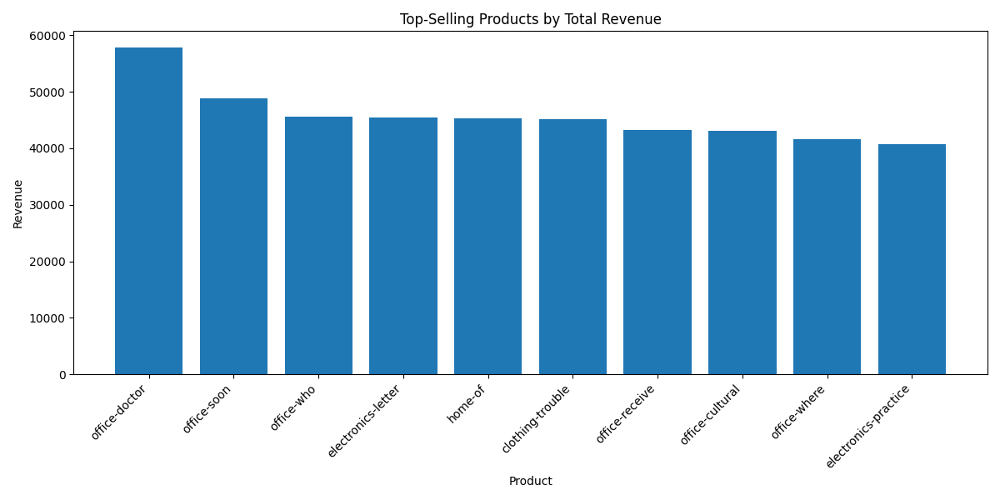

### Revenue by Region and Product
### * Central
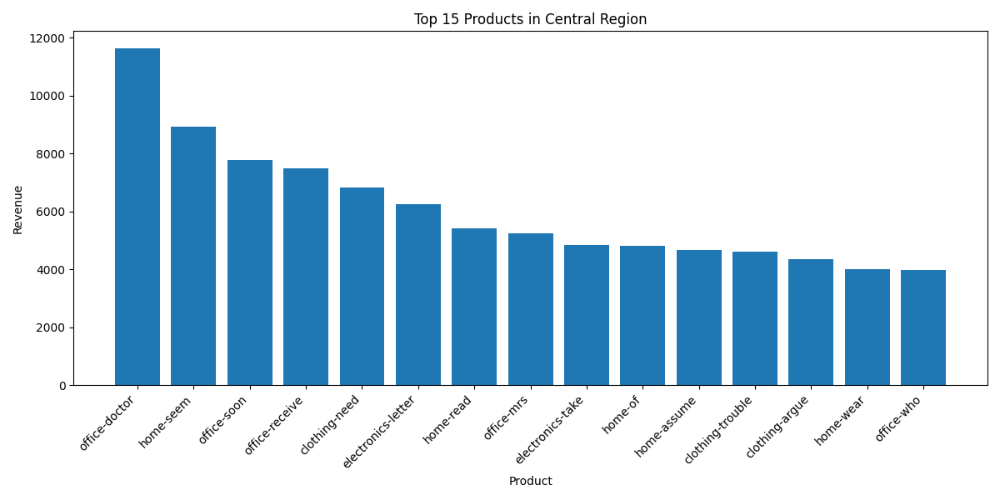
### * East
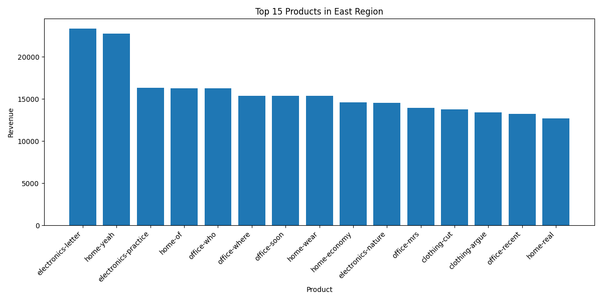
### * North
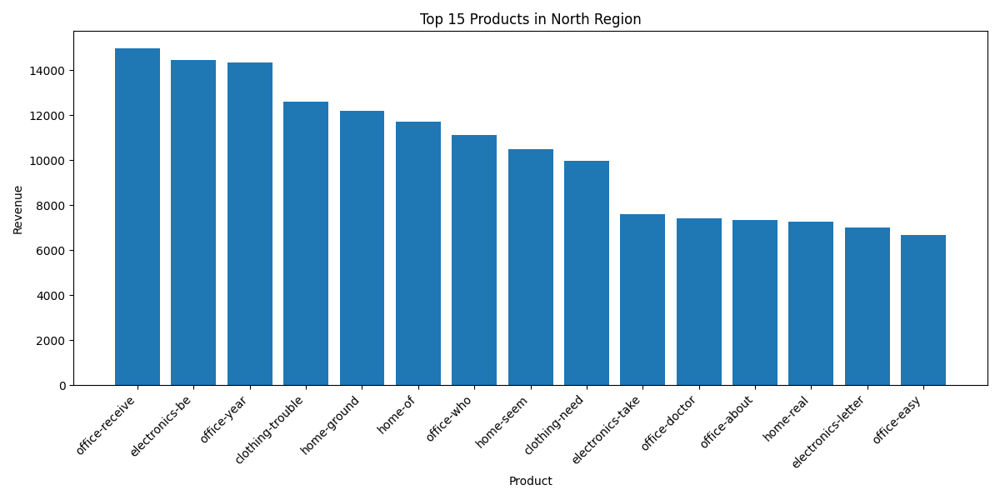
### * South-West
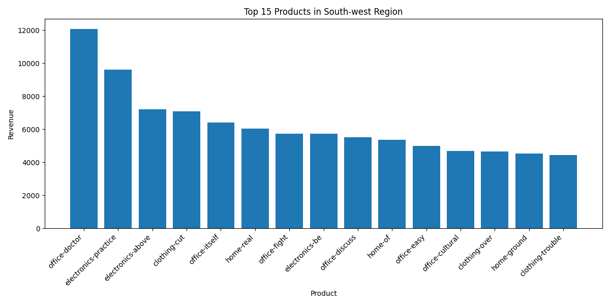
### * South
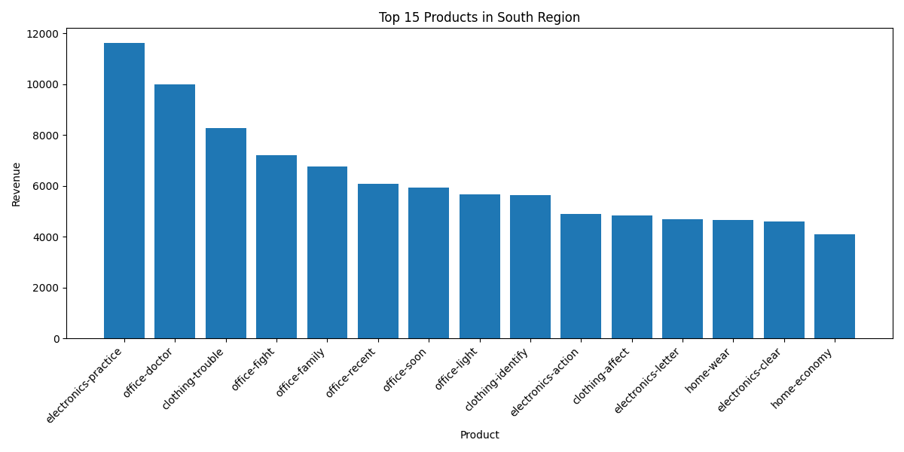
### * West
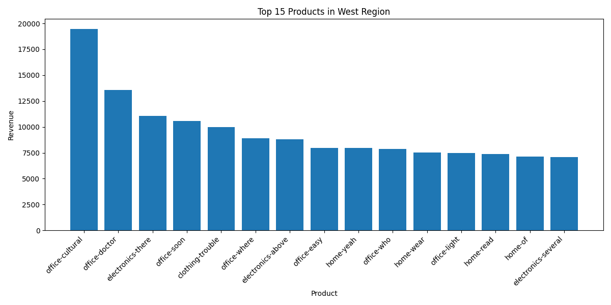

## Top Product Per Region
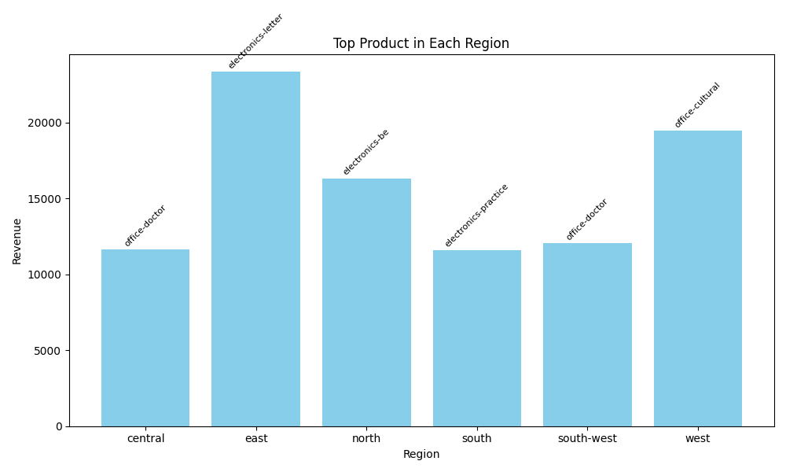

## Region-Month Trend
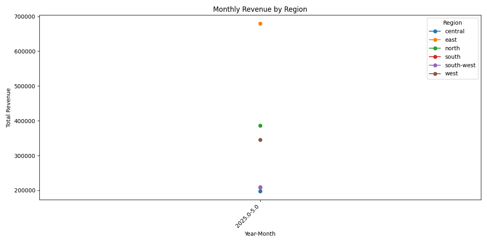

## Transactions Per Region
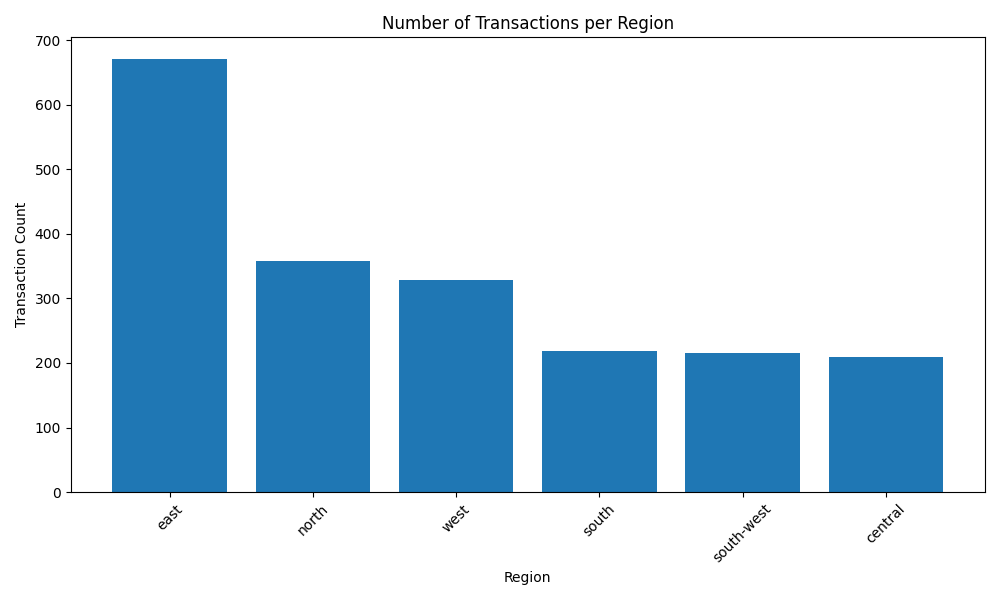

## Lowest Revenue Products
I chose to also add in lowest selling products overall. We could go further and add per region but I've chosen not to do that with lowest for now.
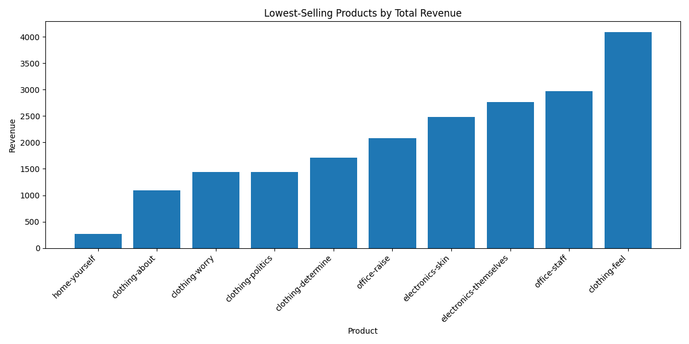

→ Office products are the highest earning products.
→ East shows highest revenue and the most demand.
→ Seasonal trend – hard to determine when sales dates are all the same.

## 6. Suggested Business Action
- Increase stock for top selling items in the East and West regions.
- Ensure high-performing categories are marketed accordingly, especially for top performing products.
- With the sale date all being the same date, its hard to see according to season but that could be something that is recommended for a better forecast on seasonal demand items.
- Review results for low-selling products and consider discontinuing the items and having a sale or clearance event.

## 7. Challenges
I started with creating more visualizations from Power BI but I wanted to challenge myself more so I used VSCoder to create my results and visuals too. I created the results originally in the wrong folder but I changed that and saved them in my OLAP folder.  I also decided to create more visualizations than probably necessary to try to challenge myself and see what is possible to create, how it worked. I also did not use the cube, I pulled directly from the data warehouse and this took me a minute to figure out I didn't have to use the cube. Another challenge I had was when originally creating the graphics, the charts seemed way overloaded so I put into the script to choose the top 15.

**Updated Project structure:**
src/
  analytics_project/
    utils/
    data_preparation/
    dw/
data/
  raw/
  prepared/
  warehouse/
olap/
  goal_top_products.py
  *.csv
  *.png
README.md

Update README.md with this weeks process.
git add .
git commit -m "Completed OLAP Analysis and Visualizations"
git push -u origin main

